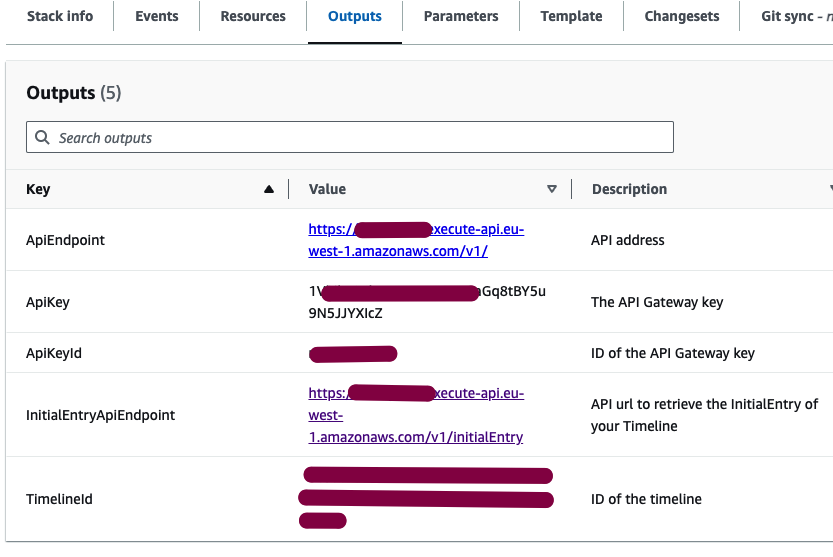

# AWS Simple Blue Timeline

This is a simple app (CloudFormation Stack) that sets up a Blue Timeline on your AWS Account. It allows you creating and persisting timeline messages (entries) on your own infrastructure.  

This service is available as a CloudFormation template, and you can quickly launch it using the button below. Your timeline will be automatically configured to stream messages to [timeline.blue](https://timeline.blue/), but you can customize the solution to use a different type of consumer for your timeline or choose not to use it at all.

## Set it up

[](https://eu-west-1.console.aws.amazon.com/cloudformation/home?region=eu-west-1#/stacks/create/review?templateURL=https://s3.eu-west-1.amazonaws.com/bc-production-timeline-provider-cfn/aws-simple-blue-timeline.yaml&stackName=SimpleBlueTimeline)


## Architecture


API Gateway exposes an API endpoint for creating entries (timeline messages) and DynamoDB table to store them. Timeline keys are stored in the Systems Manager Parameter as a SecureString.

When creating new timeline entries (messages) they are automatically pushed to SQS Queue that by default is used by [timeline.blue](https://timeline.blue/) for message polling - CFN CustomResource registers your Stack in [timeline.blue](https://timeline.blue/) as a timeline provider.


## Usage

Once CloudFormation Stack deployment succeeded, check its Outputs tab to get:
- API endpoint
- API key




To create a new message in your timeline, just send a JSON request, with a mandatory `message` field, to your ApiEndpoint. Set your ApiKey in the `x-api-key` http header.

```bash
curl -X POST \
  -H "x-api-key: ${ApiKey}" \
  -H "Content-Type: application/json" \
  -d '{
    "message": {
      "foo": "bar"
    }
  }' \
  ${ApiEndpoint}
```

## Timeline Initial Entry
To retrieve the Initial Entry of your Timeline, just click on the InitialEntryApiEndpoint link in the CloudFormation Outputs.

This Initial Entry should be treated as a source of your timeline when creating subscriptions, building contracts for instance at [timeline.blue](https://timeline.blue/).  

You can also read your public key from the Initial Entry to verify the authenticity of your messages. 

Initial Entry format:
```yaml
id: XXX
timeline: XXX
created: 2023-11-30T07:27:38.164Z
signature: XXX
message:
  type:
    name: AWS Basic Timeline with Secp256k1 Schnorr Signature
    sha256: 23aa0524e8c55087599917f05a25fc40fc18b25e8ae1de6b81329de7501727bc
  name: MyTimeline
  sqs: arn:aws:sqs:eu-west-1:000000000000:SimpleBlueTimeline-TimelineEntriesSQS-xxx
  publicKey: XXX
```
