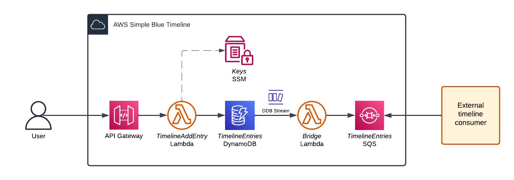

# AWS Simple Blue Timeline

This is a simple app (CloudFormation Stack) that sets up a Blue Timeline on your AWS Account. It allows you creating and persisting timeline messages (entries) on your own infrastructure and it automates the process of transmitting created messages to TimelineBlue that distributes them across subscribers registered at TimelineBlue.

## Set it up

[](https://eu-west-1.console.aws.amazon.com/cloudformation/home?region=eu-west-1#/stacks/create/review?templateURL=https://s3.eu-west-1.amazonaws.com/bc-production-timeline-provider-cfn/aws-simple-blue-timeline.yaml&stackName=SimpleBlueTimeline)


## Architecture


API Gateway exposes an API endpoint for creating entries (timeline messages) and DynamoDB table to store them. Timeline keys are stored in the Systems Manager Parameter as a SecureString.

When creating new timeline entires (messages) they are automatically transmitted to TimelineBlue with DynamoDB Streams and SQS Queue. SQS messages are polled by the TimelineBlue service - EventSourceMapping is configured during the CloudFormation Stack deployment - CFN CustomResource registers Stack as timeline provider for TimelineBlue.


## Usage

Once CloudFormation Stack deployment succeeded you can see the new RestAPI in the AWS ApiGateway console:


Data you will need to use the API:
1. API endpoint. You can find in a API Stage view, API Dashboard (Invoke URL) or outputs of the CloudFormation Stack:
   
   

2. API Key, available in the API Keys view:

   

Below is an example of how you can create a new timeline entry by calling the API endpoint:

```bash
curl -X POST \
  -H "x-api-key: ${API_KEY}" \
  -H "Content-Type: application/json" \
  -d '{
    "message": {
      "${key}": "${value}"
    },
    "thread": "${Thread}",
    "threadPrev": "${ThreadPrev}",
    "timelinePrev": "${TimelinePrev}"
  }' \
  https://${API_ID}.execute-api.eu-west-1.amazonaws.com/v1/
```

## Timeline Initial Entry
Read it form the CloudFormation Stack Output as a json string. 

This Initial Entry should be treated as a source of your timeline when creating subscriptions, building contracts at TimelineBlue etc. 
You can also read your public key from the Initial Entry to verify the authenticity of your messages. 

Initial Entry format:
```json
{
  "id":"XXX",
  "timeline":"XXX",
  "created":"2023-11-21T21:09:12.837Z",
  "signature":"XXX",
  "message":{
    "type":{
      "name":"AWS Basic Timeline with Secp256k1 Schnorr Signature",
      "sha256":"5f7f807162fc46ca4733d293cffc60dcbfe8c247bfa33f8a2d9b420bbe1415be"
    },
    "name":"MyTimeline",
    "sqs":"arn:aws:sqs:eu-west-1:000000000000:SimpleBlueTimeline-TimelineEntriesSQS-xxx",
    "publicKey":"XXX"
  }
}
```